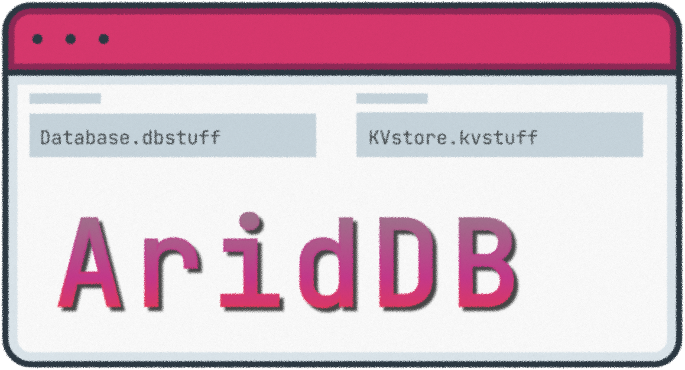

<div align="center">




_A lightweight, embeddable, file-based database for Python — no SQL, no server, no setup._

[]()
[](LICENSE)
[](https://github.com/CheefLofter/AridDB/commits)
[](https://github.com/CheefLofter/AridDB/issues)
[]()
[](https://www.python.org/)
[](https://github.com/psf/black)
[](https://github.com/CheefLofter/AridDB/pulls)

</div>

---

## 📋 Table of Contents

- [About](#-about)
- [Features](#-features)
- [Installation](#-installation)
- [Quick Start](#-quick-start)
- [API Reference](#-api-reference)
- [Roadmap](#-roadmap)
- [Contributing](#-contributing)
- [License](#-license)

## 📖 About

AridDB is a simple embeddable database and key-value store that persists data
to the local file system. Instead of writing SQL or running a separate database
server, you interact with your data through clean, built-in Python functions —
making it ideal for small projects, prototypes, and local tooling.

## ✨ Features

- 🔌 **Embeddable** — the database lives inside your project; nothing to install or run
- 📁 **File-based** — data persists as plain files on your local file system
- 🚫 **No SQL** — store and retrieve data with simple, readable method calls
- 🔑 **Auto-indexing** — rows receive auto-generated indexes out of the box
- 🗝️ **Key-value store** — includes a companion `AridKV` class (in development)
- 🪶 **Lightweight** — a minimal, readable codebase you can fully understand

## 📦 Installation

Clone the repository and add the source file to your project:

```bash
git clone https://github.com/CheefLofter/AridDB.git
```

> 📌 A PyPI package is planned for a future release.

## 🚀 Quick Start


```python
from ariddb import AridDB
#from aridkv import AridKV

# Create or open a database
db = AridDB("database") # can be left blank
#kv = AridKV("kvstore")

# Add a row — the index is auto-generated
db.addRow(["Alice",30])
# kv.addRecord({"name": "Alice", "age": 30})

# Read it back
row = db.readRow(index)
print(row)


```

Initializing a database or a kvstore will create a .dbsuff/.kvstuff file in the same directory 
It will also check for existing files and will use them if posible 

## 📘 API Reference

### `AridDB`

| Method | Description |
|--------|-------------|
| `addRow(data)` | Add a new row with an auto-generated index |
| `addRows(data)` | addes multiple rows from an array(lsit) of data |
| `readRow(index)` | Read a single row by its index | 
| `deleteRow(index)` | deletes the row at the given index |
| `dumpDB()` | Dump the contents of the database | 
| `editRow(data, index, primaryKey)` | Edit an existing row | 


### `AridKV` — Key-Value Store

| Method | Description | 
|--------|-------------|
| `addRecord(filename, data)` | Store a key-value pair | 
| `readRecord(filename, index)` | Retrieve a value by index | 
| `deleteRecord(filename,index)` | deletes a record at index |
| `editRecord(filename,index,data)` | edits a record at given index |
| `dumpRecords()` | dumps full kvstore as a string |


## 📄 License

Distributed under the [MIT License](LICENSE). See `LICENSE` for more information.


